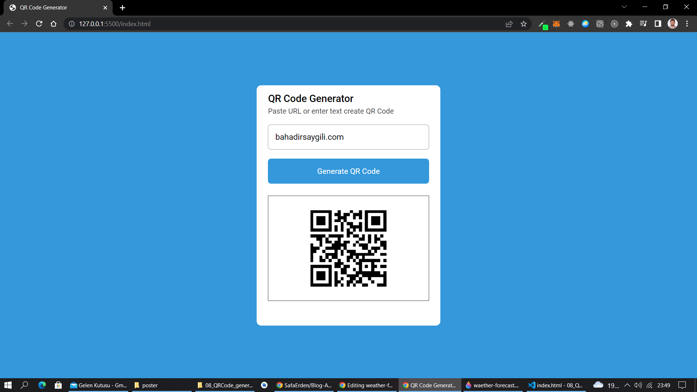

<h2> Chrome Extension: QR Code Generator</h2>

<h3>Setup:</h3>

<ol>
    <li>Clone this project.</li>
    <li>Open in VSCode or other development IDE.</li>
    <li>Select "index.html" file, press F5 or use LiveServer</li>
</ol>

<h3>Built with:</h3>
<ul>
    <li>HTML</li>
    <li>CSS</li>
    <li>JavaScript</li>
    <li>QRCode Genarator Api</li>
</ul>

<h3>Author</h3>

Bahadır SAYGILI

<ul>
    <li>Github : <a href="https://github.com/bsaygili">@bahadirsaygili</a></li>
    <li>Linkedin : <a href="https://www.linkedin.com/in/bahadir-saygili/">@bahadirsaygili</a></li>
    <li>website : <a href="https://www.bahadirsaygili.com/">www.bahadirsaygili.com</a></li>
</ul>

<h3>Contributing</h3>

Contributions, issues and feature requests are welcome!

Feel free to check the<a href="https://github.com/bsaygili/" target="_blank"> issues page</a>

<h3>Show your support</h3>

Give a ⭐️ if you like this project!

